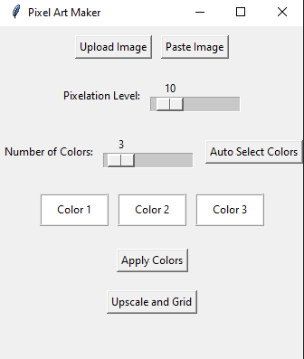
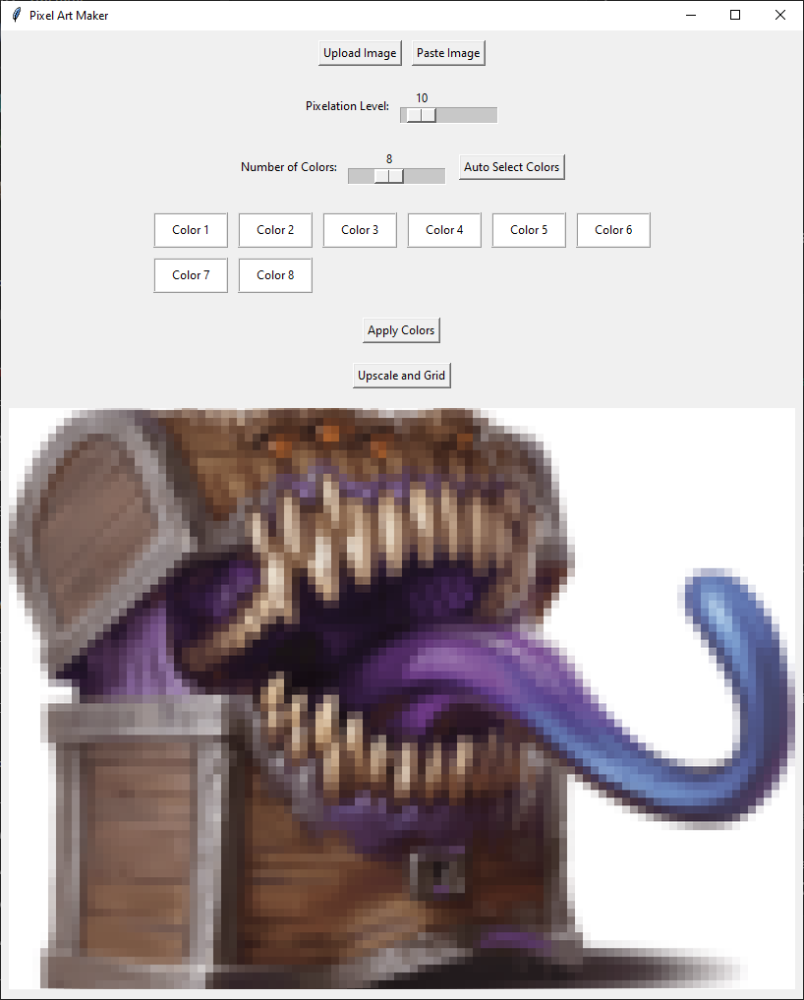
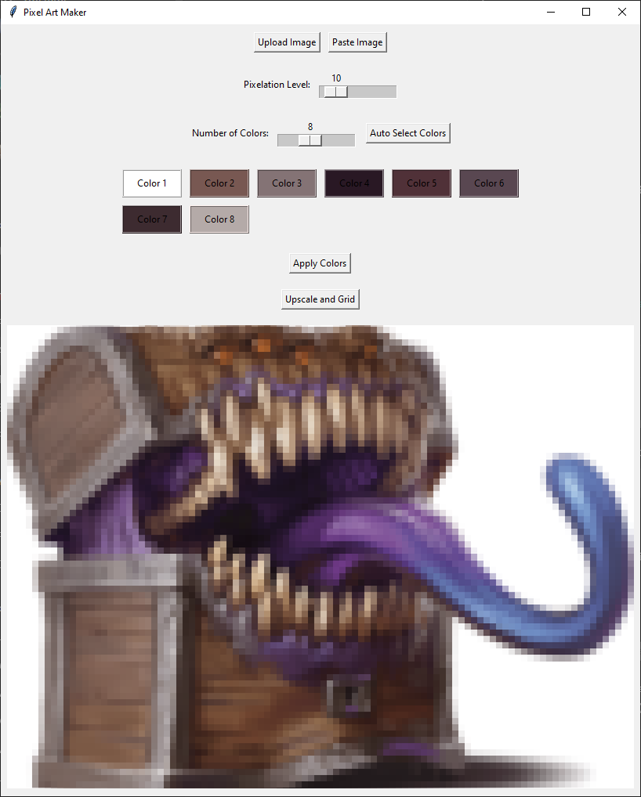
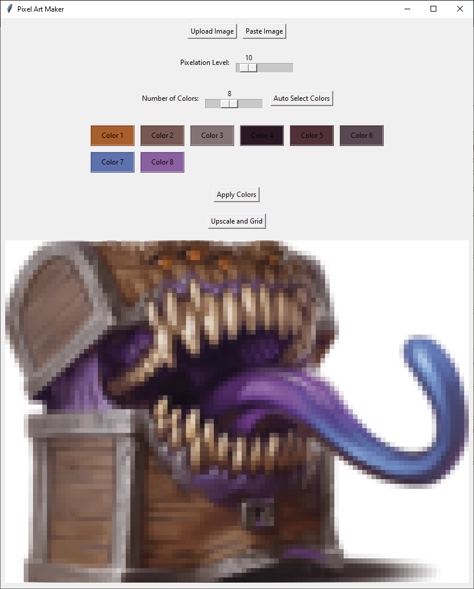
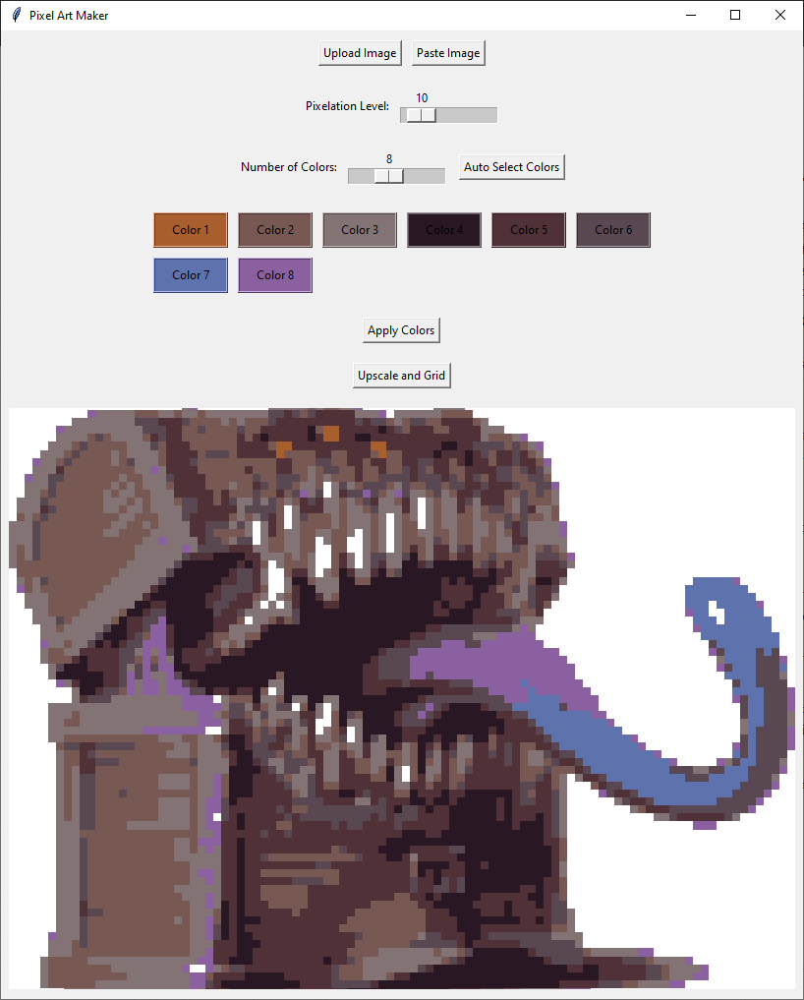
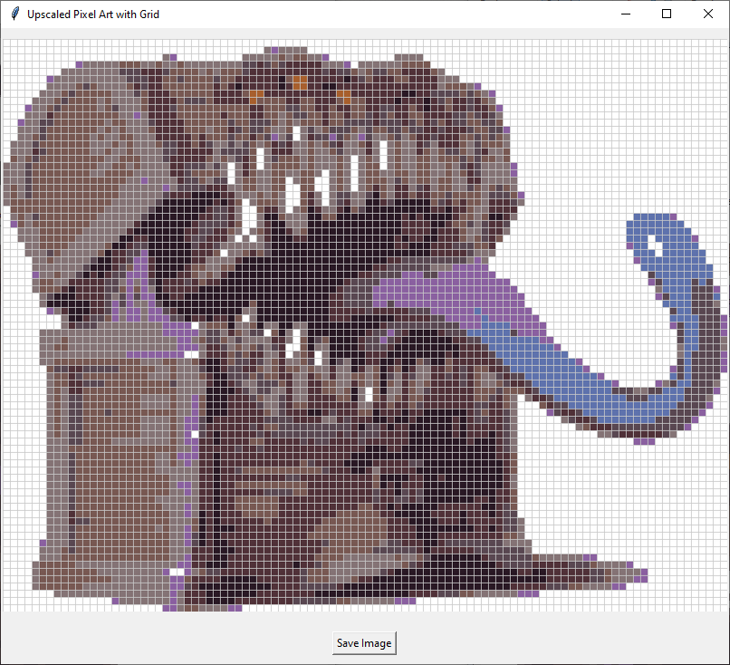

# Crochet Pixel Art

A simple pixel art tool made to take an image and convert it into pixel art then add a grid. Designed to help a friend with making patterns for crochet, but realistically works for pixel art in general.  
## Requirements
Install dependencies with:
```bash
pip install -r requirements.txt
```

## Usage

### Command line Specific
Start the program
```bash
python app.py
```
### Using the Program
Upon opening the program you will see:  


Upload Image: Use this to upload an image to the program
Paste Image: Grabs image from your clipboard
Pixelation Level: Slider for how much pixelation you want, updates dynamically
Number of Colors: Slider for how many colors you want in the final image, goes up to 18
Auto Select Colors: When pressed it will try to autofil your color boxes with colors from your image. I would recommend fine tuning manually as it tends to not include accent colors
Color Boxes: Displays your colors, defaults to white, simply click to choose a new color using eyedropper
Apply Colors: Applies the colors from your color boxes onto the image
Upscale and Grid: Upscales the image and applies a grid to it.

1. Upload an image, for the example i used a mimic from dndbeyond  
(https://www.dndbeyond.com/monsters/16957-mimic)


2. Decide how many colors you want in the final product (I picked 8)
3. Click Auto Select Colors to give you a good baseline for the colors.


4. (Optional) I recommend then refining the colors, in my example i am grabbing a purple, blue, and orange from the image. Swapping them in where the colors seemed redundant to me.


5. Click Apply Colors (if it freezes dont worry its apply the colors, just give it a moment)


6. Assuming you like the result you can then press Upscale and Grid, if you want to change colors, just adjust the pixelation level and it will display the original again. (I'll have to add a button for this)
7. That will pop out a new window with the upscaled version with a grid, simply click Save Image if you are satisfied. Note the grid is set to scale to pixel size, so the smaller the pixel the smaller the grid and vice versa.

